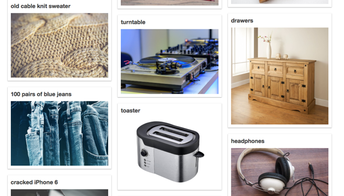
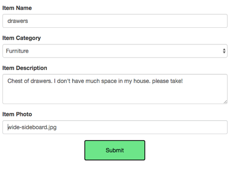
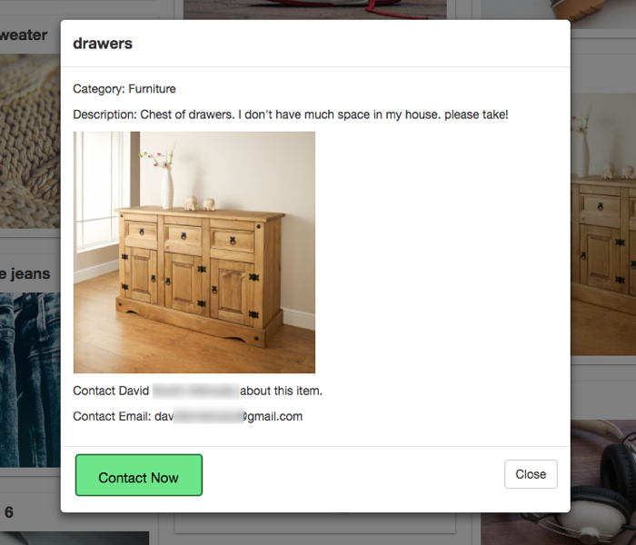

# Let Go - Go Get

_Let Go of items that clutter your life. Go Get items that others no longer need._

This app is a platform to help people eliminate clutter while helping other people. An unneeded item for one person might be an important necessity for another person. All items on the site are free. 

The app is deployed at http://let-go-go-get.herokuapp.com/.

_Note: This is a sample app and does not contain actual items._

## Design and architecture

This is a full-stack JavaScript app, and the architecture follows a model-view-controller pattern. It demonstrates routes, body-parsing middleware, and GET and POST requests to a server. 

On the backend, MySQL stores the data and Sequelize is used to build the SQL queries. User and item model tables are linked through a one-to-many association where a user can have many items and an item belongs to one user.

To _let go_ of an item, you need to sign in with a Google account, and provide some details and a link to a photo. 

Other users can browse the site and contact you at your Google account email address if they want to _go get_ your item.

## Local set up for development purposes

These must be installed to run the app locally:

- [Node.js](https://nodejs.org/en/)
- [npm](https://www.npmjs.com/get-npm)
- [MySQL](https://www.mysql.com/)

You first need to make a local MySQL database named `letgogoget_db`. Then, in a terminal window, navigate into the folder where you downloaded this app and type `npm install`. In `config/config.json`, enter the connection information and credentials to your database. 

The first time you run the app, use [db.sequelize.sync({force: true})](https://github.com/himajagattu/let-go-go-get/blob/b488e5832f704c00f4fc0be39916b218609ec7e2/server.js#L40) to create empty tables using the Sequelize models. Change this line back to avoid dropping the tables on future runs.

To start the app, type `node server.js` and open your browser to `localhost:8000`.

## License

This project is licensed under the MIT License; see the [LICENSE.md](LICENSE) file for details

## Technology

- HTML, CSS, Bootstrap, jQuery, and [masonry.js](https://masonry.desandro.com/)
- JavaScript
- Node.js and various [npm packages](https://github.com/himajagattu/let-go-go-get/blob/master/package.json)
- MySQL and [Sequelize](http://docs.sequelizejs.com/)
- [Express.js](https://expressjs.com/)
- [passport.js](http://www.passportjs.org/)

## Authors

- [David Booth-Metwally](https://github.com/dboothy)
- [John Cordano](https://github.com/johncordano)
- [Himaja Gattu](https://github.com/himajagattu)
- [Rhonda Glennon](https://github.com/rmglennon)

## Acknowledgments

- Thanks to Amber, Abraham, and Dani for support and code review.